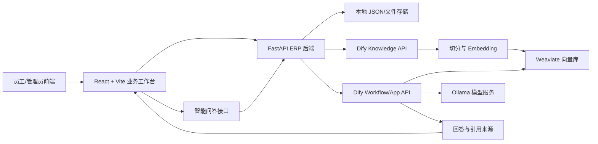

# RAG 知识库系统项目汇报与验收说明

更新时间：2026-08-24  
项目目录：`/Users/frankgod/Desktop/RAG_t/Test_python_frontend_sandbox_copy`

## 一、项目定位

本项目是一套企业知识管理与智能问答平台，负责文档、档案、权限、索引状态和业务操作；Dify 负责知识库切分、Embedding、召回、Rerank 和 Workflow 问答。

系统目标是把传统文档管理和 RAG 问答统一到一个业务入口中：员工在前端上传或管理资料，授权文档同步到 Dify 知识库，员工通过智能问答查询制度、合同、档案和业务流程。

## 二、技术线路



## 三、已经实现的功能

### 业务管理

- 工作台和合同管理
- 文档库、档案库、档案目录
- 文档上传、文档详情和索引状态
- 覆盖看板、缺失提醒
- OA 审批中心入口
- 用户登录、角色权限和 Bearer Token 鉴权

### AI/RAG 能力

- 文档同步到 Dify 知识库
- Dify 索引状态刷新
- Dify Dataset 召回接口
- Dify Workflow/App 问答接口
- 智能问答页面 `/assistant`
- 会话 ID 保留和知识来源展示
- 后端权限过滤，避免员工看到无权访问的文档

## 四、汇报建议流程

建议汇报控制在 15 到 20 分钟，按“业务问题 → 技术方案 → 系统演示 → 验收结果 → 下一步”展开。

### 1. 背景与问题（2 分钟）

说明传统文档管理存在三个问题：资料分散、查找依赖人工、制度和流程无法直接转化为可问答知识。

### 2. 总体方案（3 分钟）

展示技术线路：

```text
用户输入
  → 业务前端
  → ERP 后端鉴权与权限过滤
  → Dify 知识库切分/Embedding/召回/Rerank
  → Dify Workflow 生成回答
  → 返回答案与引用来源
```

强调 Dify API Key 只保存在后端，前端不直接接触密钥；员工只能查询当前权限范围内的资料。

### 3. 功能演示（6 到 8 分钟）

按以下顺序演示：

1. 使用 `admin/admin` 登录。
2. 打开工作台，展示合同、档案治理和知识库入口。
3. 打开“文档库”，展示文档状态、AI 可用状态和同步入口。
4. 打开“知识库索引状态”，说明文档从上传到索引完成的状态变化。
5. 打开“智能问答”，输入一个明确的问题，例如：`采购审批制度中超过 5 万元的审批流程是什么？`
6. 展示回答、会话标识和知识来源区域。
7. 回到工作台，演示快捷入口跳转到智能问答。

### 4. 权限与治理说明（2 分钟）

说明系统不是简单把所有文档交给模型，而是先经过 ERP 用户身份和文档权限过滤，再把允许范围内的片段交给 Dify。敏感文档、未允许进入 AI 的文档和未完成同步的文档不应进入员工问答范围。

### 5. 验收结论与下一步（2 到 5 分钟）

明确区分当前结论：

- 业务平台、登录和页面流程可用。
- Dify 配置和 Docker 基础设施可用。
- 当前真实召回仍为空，RAG 端到端验收尚未通过。
- 下一步优先修复 Dify Rerank/Embedding 模型调用和文档索引状态，再重复召回与问答验收。

## 五、当前验收结果

| 验收项 | 结果 | 证据/说明 |
|---|---|---|
| 前端 5175 | 通过 | Vite 服务正在监听 `5175` |
| 后端 18114 | 通过 | `/health` 返回 `{"status":"ok"}` |
| admin 登录 | 通过 | `admin/admin` 返回 200 和有效 Bearer Token |
| Dify 配置 | 通过 | `enabled=true`、Dataset 已配置、Workflow App Key 已配置 |
| Dify Docker | 通过 | API、Worker、PostgreSQL、Redis、Weaviate 均在运行 |
| Dataset 召回 | 未通过 | 实测 `chunks=[]`，没有返回知识片段 |
| Workflow 问答 | 未通过 | 之前实测调用超过 75 秒未返回 |
| 前端智能问答页面 | 通过 | `/assistant` 可打开、可登录、可提交问题、可显示回答状态 |

## 六、当前问题判断

当前问题不在前端登录或业务 API。Dify 日志曾出现以下错误：

```text
[models] Error: Connection error occurred
```

错误发生在 Rerank 模型调用阶段；当前 Workflow 使用了 Ollama Rerank 模型：

```text
dengcao/Qwen3-Reranker-8B:Q5_K_M
```

因此可能出现以下现象：

- Dataset 召回返回空记录
- Workflow 长时间等待或超时
- 前端显示“没有在当前可见知识库范围内检索到相关内容”
- GPU 占用升高或模型服务无响应

## 七、恢复 RAG 可用性的操作顺序

1. 在 Dify 知识库中确认目标文档状态为“可用/索引完成”。
2. 在 Workflow 的知识检索节点暂时关闭 Rerank，先验证基础向量召回。
3. 如果需要 Rerank，替换为 Ollama 中已确认可调用的轻量模型。
4. 在 Dify 控制台执行一次召回测试，确认返回至少一条记录。
5. 重新发布 `rym-1` Workflow。
6. 用同一个问题分别测试 Dify API、ERP `/erp/v1/ai/retrieve` 和前端 `/assistant`。
7. 记录答案、引用文档名、相关度和响应耗时，作为正式验收材料。

## 八、启动与验收命令

### 启动业务后端

```bash
cd /Users/frankgod/Desktop/RAG_t/Test_python_frontend_sandbox_copy
source .venv-local/bin/activate
python -m uvicorn app.main:app --reload --host 127.0.0.1 --port 18114
```

### 启动业务前端

```bash
cd /Users/frankgod/Desktop/RAG_t/Test_python_frontend_sandbox_copy
VITE_BACKEND_BASE_URL=http://127.0.0.1:18114 \
npm run dev -- --host 0.0.0.0 --port 5175
```

### 基础检查

```bash
curl http://127.0.0.1:18114/health
```

浏览器地址：

```text
http://127.0.0.1:5175/assistant
```

演示账号：

```text
账号：admin
密码：admin
```

## 九、汇报时的准确表述

建议对外表述为：

> 当前已经完成企业知识管理工作台、权限控制、Dify 接入和智能问答前端。业务端登录、文档管理、Dify 配置和基础设施均已验证；目前正在处理知识库索引及 Rerank 模型调用问题，完成该项后即可进行 RAG 端到端验收。

不要在 Rerank 和召回问题修复前表述为“知识库问答已经完全可用”。更准确的状态是：平台可用，RAG 链路已接通但仍处于联调阶段。

